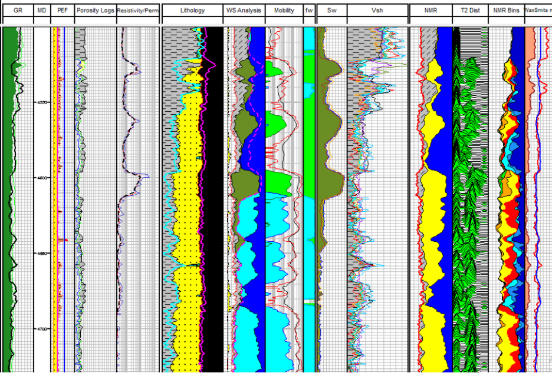
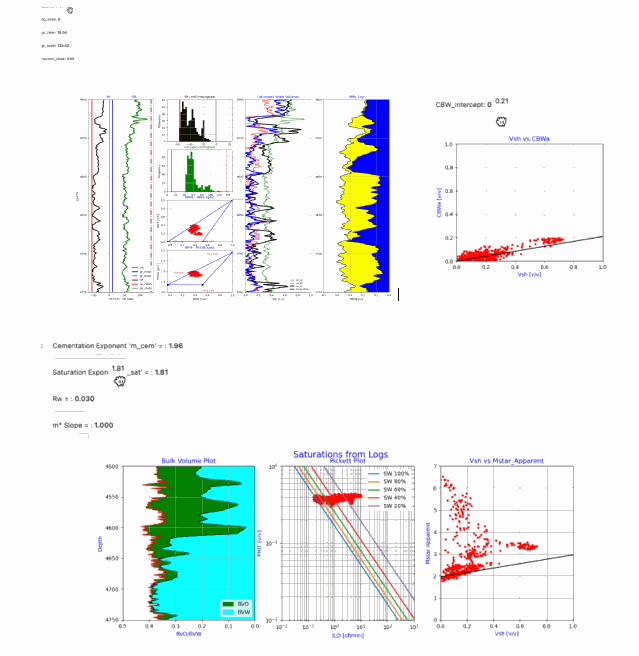

# Geolog-Project-Notebook-for-a-Comprehensive-Interactive-Petrophysical-Analysis-Workflow
This repository has all of the python code and methods for a Comprehensive interactive petrophysical analysis workflow using python’s Panel and Param for both Jupyter Notebooks and as python loglans in a complete Geolog project. 

**Geolog Final Depth Plot**

**Interactive Widgets using python Panem and Param libraries in our Interactive Workflow**

The workflow of this project includes the following steps:

1)	1_phit_chartbook
This python module or loglan calculates PHIT based on 1-of-4 SLB Neutron-Density chartbooks that have been digitized for the point data and then we use KNN to estimate PHIT and RHOMAA from the chartbook data. 

2)	2_optimize_lith
This python loglan module utilizes an optimization technique published by Ruben Charles on LinkedIn as well as obtaining actual code on GitHub

        (https://github.com/ruben-charles/petrophysical_evaluation_optimization_methods). 

We forked his repository and refined his technique that can be found in this GitHub repository: 

        (https://github.com/Philliec459/petrophysical_evaluation_optimization_methods). 

3)	3_Vsh
In his module we calculate a final Vsh from multiple shale indicators in a Hodges-Lehmann approach to Shale Volume. This is our first interactive python program where we use Param and Panel slide bars for interactive end point parameters for our shale indicators. As we adjust the slide bars for each shale indicator, we have a real-time calculations for each shale indicator being used. All shale indicators are then used to calculate the final Hodges-Lehman Shale Volume.  

4)	4_CBW
We use this interactive loglan to model CBW in order to calculate PHIE. The calibration data for our trend is based on the difference between  PHIT and our NMR effective porosity: 

                CBWa = PHIT – MPHI 

and then use the CVWa vs. Vsh, and then use the trend of these data to model CBW for the entire well to correct for any light hydrocarbon intervals for an accurate CBW for the entire well.

5)	5_pickett
This interactive loglan uses an interactive Pickett plot with Panel to vary the m, n and Rw for our water saturation analysis. 

We then cross plot Vsh vs. m*_apparent to fine tune our electrical property m* to be used in the Waxman-Smits water saturation calculations. We fit a line to the wet trend slope of Vsh vs. m*_apparent cross plot to model m*.

                m*_apparent = log10(Rw/(Rt*(1+Rw*B*Qv)))/log10(PHIT)

To calculate Qv, we utilize the estimated volume of Clay Bound Water (CBW) and the equation:

        			Swb = CBW/PHIT

and then calculate Qv using the Hill Shirley and Klein equation shown below:

        		Qv = Swb / (0.6425 / ((Fluid_Density * Salinity(kppm)) ** 0.5) + 0.22)

6)	6_wsats
In this program we calculate water saturations using Archie, Dual Water and Waxman-Smits. The Dual-Water method comes from George Coates’ MRIAN analysis where he used a systematic approach of using both conventional and NMR logs to perform his calculations. Experience has shown that this method is extremely good with very little adjustment needed for any of the petrophysical parameters like w. The Waxman-Smits technique is more tunable, but eventually delivers nearly the same results as Coates’ Dual-Water analysis. The Dual-Water uses a variable w for the electrical property and the Waxman-Smits uses a variable m* in the water saturation calculations. 

7)	7_Permeability and Relative Permeability Calculations 
This is the final program that calculates Permeability from NMR and then calculates Relative Permeability for Oil and Water to estimate a production index at each level using fractional flow. 

